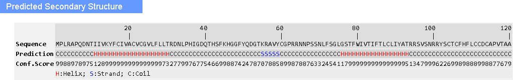

# Homology Modeling of Unknown 3D Protein (A0A8D5WHE7)

**Course:** Structural Bioinformatics (Binfo-605)  
**Author:** Ruqia Arshad (2020-ag-6295) | BS(BI) Section A  
**Institution:** University of Agriculture, Faisalabad  

---

## 1.0 Abstract
This project focuses on the homology modeling of the unknown protein **A0A8D5WHE7** from the Wheat virus Q, which currently has no resolved PDB structure. Multiple structure prediction tools were utilized, including **Swiss-Model, Robetta, MODELLER, and I-TASSER**. 

Models were evaluated based on GMQE, coverage, identity, z-scores, and c-scores. The top models from each tool were further validated using **ERRAT, Verify 3D, and PROCHECK**. 

While the I-TASSER model initially showed the best validation scores, compatibility issues with WinCoot and MolProbity necessitated a switch. After evaluating and refining the Swiss-Model and Robetta predictions, the **Robetta model**, following refinement via **GalaxyRefine**, was selected as the final structure. The final refined model achieved excellent geometry with a Ramachandran favored score of 94.07% and 0 outliers.

---

## 2.0 Target Protein Details
* **Organism:** Wheat virus Q (Taxonomy ID: 2859709)
* **Protein ID:** A0A8D5WHE7
* **Gene:** TGB2
* **Length:** 120 AA
* **Protein Function:** Plays a role in viral cell-to-cell propagation by facilitating genome transport to neighboring plant cells through plasmodesmata.

### 2.1 Protein Sequence (FASTA)

```fasta
>tr|A0A8D5WHE7|A0A8D5WHE7_9VIRU Movement protein TGB2 OS=Wheat virus Q OX=2859709 GN=TGB2 PE=3 SV=1
MPLRAPQDNTIIVKYFCIVACVCGVLFLLTRDNLPHIGDQTHSFKHGGFYQDGTKRAVYC
GPRRNNPSSNLFSGLGSTFWIVTIFTLCLIYATRRSVSNRRYSCTCFHFLCCDCAPVTAA
```



---

## 3.0 Structure Prediction & Initial Validation

### 3.1 Swiss-Model
* **Selected Template:** `6t0b.1.b`
* **Sequence Identity:** 23.33%
* **GMQE:** 0.06
* **Coverage:** 0.2

| Models | ERRAT | Verify 3D | PROCHECK (Overall Score) |
| :--- | :--- | :--- | :--- |
| 6t15.1.Y | 100 | 0.00 >= 0.2 | -0.14 |
| **6t0b.1.b (Selected)** | **100** | **0.00 >= -0.2** | **-0.13** |
| 6ymy.1.E | 50 | 0.00 >= 0.2 | -0.12 (Ramachandran pass) |
| 8age.1.H | 75 | 2.44 > 0.2 | -0.42 |

### 3.2 I-TASSER
* **Selected Model:** Model 3
* **C-score:** -4.38

| Models | C-score | ERRAT | Verify 3D | PROCHECK |
| :--- | :--- | :--- | :--- | :--- |
| Model 1 | -4.04 | 33.03 | 69.17 >= 0.2 | -1.45 |
| Model 2 | -4.02 | 48.21 | 62.50 >= 0.2 | -1.12 |
| **Model 3 (Selected)** | **-4.38** | **70.53** | **88.33 > 0.2 (Pass)** | **-1.29** |
| Model 4 | -4.60 | 41.96 | 67.50 >= 0.2 | -1.17 |
| Model 5 | -4.38 | 62.50 | 75.83 >= 0.2 | -1.34 |

### 3.3 Robetta
* **Selected Model:** Model 2
* **Confidence Score:** 0.63

| Models | ERRAT | Verify 3D | PROCHECK |
| :--- | :--- | :--- | :--- |
| Model 1 | 93.39 | 30.00 >= 0.2 | 0.29 |
| **Model 2 (Selected)** | **89.10** | **51.67 > 0.2** | **0.21** |
| Model 3 | 90.82 | 31.67 >= 0.2 | 0.22 |
| Model 4 | 86.53 | 31.67 > 0.2 | 0.20 |
| Model 5 | 98.97 | 30.83 > 0.2 | 0.28 |

*(Note: MODELLER was also tested, but NCBI BLAST yielded no significant orthologs for template selection).*


---

## 4.0 Final Model Selection & Refinement Process

Initially, the **I-TASSER (Model 3)** was selected due to superior ERRAT (70.53) and Verify 3D (88.33) scores. However, the resulting PDB file encountered formatting errors (`MODEL/ENDMDL` card mismatches) and failed to run on WinCoot and MolProbity.

**Switch to Swiss-Model:**
The Swiss-Model `6t0b.1.b` was evaluated next. While energy minimization via UCSF Chimera and WinCoot yielded good PROCHECK results, the refinement process reduced the overall residue length. 

**Switch to Robetta (Final Choice):**
The Robetta model was selected as the final base structure. 
1. **Initial MolProbity:** Yielded 1 outlier and 91.53% Ramachandran favored.
2. **Chimera Minimization:** Resulted in poor geometry (87.29% favored, 3 outliers).
3. **WinCoot Adjustment:** Correcting phi/psi angles improved the structure to 94.07% favored, 0 outliers, and 100% favored rotamers.
4. **GalaxyRefine:** To achieve the best possible native-like state without manual over-fitting, the original Robetta model was processed through GalaxyRefine. 

---

## 5.0 Final Validation Results (GalaxyRefine of Robetta Model)

The GalaxyRefine pipeline provided the most structurally sound model. The final MolProbity geometric analysis is as follows:

| Metric | Result | Goal |
| :--- | :--- | :--- |
| **Poor rotamers** | 0.00% | < 0.3% |
| **Favored rotamers** | 99.05% | > 98% |
| **Ramachandran outliers** | **0.00%** | < 0.05% |
| **Ramachandran favored** | **94.07%** | > 98% |
| **Rama distribution Z-score** | 0.56 ± 0.60 | abs(Z score) < 2 |
| **Cβ deviations >0.25Å** | 4.46% | 0 |
| **Bad bonds** | 0.72% | 0% |
| **Bad angles** | 0.91% | < 0.1% |
| **Cis Prolines** | 0.00% | ≤1 per chain |


---

## 6.0 Conclusion
The Robetta model refined via GalaxyRefine yielded the best overall structural integrity. The refinement successfully brought the **Ramachandran favored region to 94.07%**, eliminated all geometric outliers (**0 outliers**), and achieved **99% favored rotamers**. The combination of high ERRAT and Verify 3D scores, coupled with the resolution of unfavorable phi and psi angles, confirms this as a highly reliable 3D homology model for the Wheat virus Q Movement protein TGB2.


